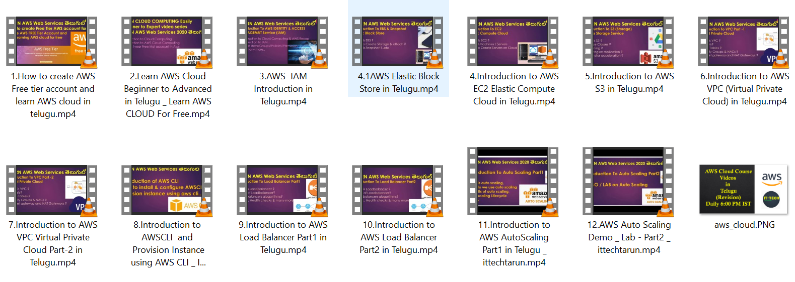

## AWS Course

 AWS is one of the most popular cloud provider.
 Amazon Web Services (AWS) is the world's most comprehensive and broadly adopted cloud platform, offering over 200 fully featured services from data centers globally.
 
 In this course you will learn basic concepts of aws cloud topics, which will help to get started your journey in the aws cloud.
 
 
 In this course, you will learn basic concepts of AWS cloud topics, which helps you start your journey in the AWS cloud.
 
 Main Topics are
  - Introduction to Cloud
  - IAM (Identity and access management) in aws
  - EC2 (Elastic compute cloud)
  - EBS (Elastic block storage)
  - S3  (Simple Storage Service)
  - VPC  (Virtual Private Cloud)
  - Loadbalancer 
  - Autoscaling
  & many more
  

All videos are completely free you can check those videos in my youtube channel, incase If you would like support my videos you can use below link.

If you want the presenation files and videos, check below link.

[Click_Here_AWS_Course](https://ittechtarun.myinstamojo.com/product/3137102/aws-cloud-course-in-telugu "Click Here For buy")