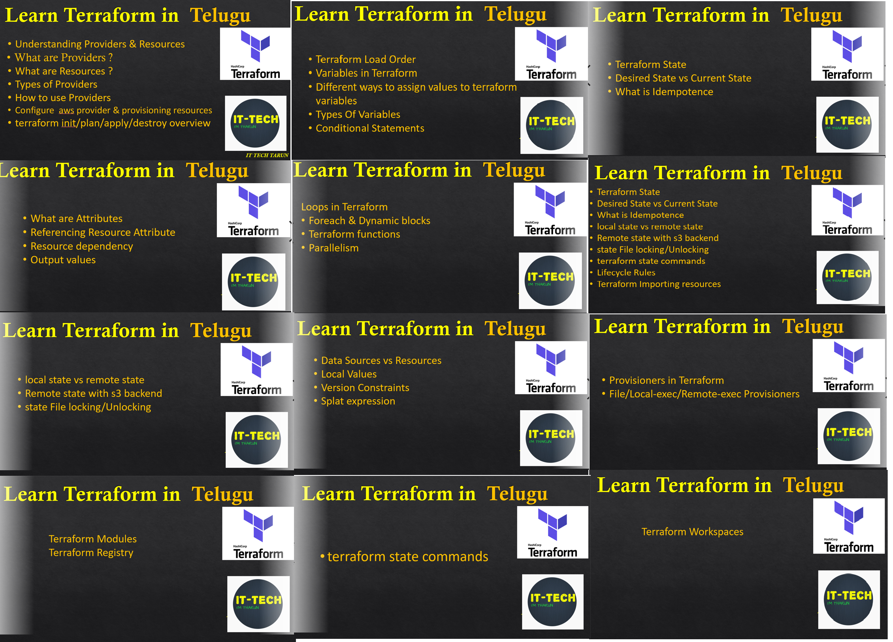

## Terraform Course

 Terraform is one of the most popular Infra Provisioning tool.
 Terraform is an infrastructure Automation tool for the infrastructure in a safe efficient and reusable way. 
 Terraform connects to various existing and popular service providers and helps create, configure and manage those services.
 In this course you will learn how to use terraform to automate your infrastructure.
 
 
 You will learn from zero(basics) level to intermediate level, learning topics along with demos and doing tasks.
 
 Main Topics are
  - Terraform Introduction
  - Terraform Providers & Resources
  - Variables in Terraform
  - Arguments & Attributes in Terraform
  - Loops in Terraform
  - Terraform States
  - Resources vs Datasources
  - Provisioners in Terraform
  - Terraform Modules/Registry/Workspaces
 
  

[Demo-Introduction To Terraform](https://youtu.be/MfPzmNQbUzg)

<h3><b>Today Special Offer at Just <i>999rs only/-</i> (Limited Time Offer for few members, Click the below link)</h3></b>

Once you have enrolled in the course, you will get access to the Terraform Recorded Sessions, Terraform_codes, Presentations, Useful links. You can watch those and learn terraform at your convenient timings.

?> You can mail to me for any queries related to courses mail to ittechtaruncourses@gmail.com.  Job Support/Troubleshooting won't be provided.
